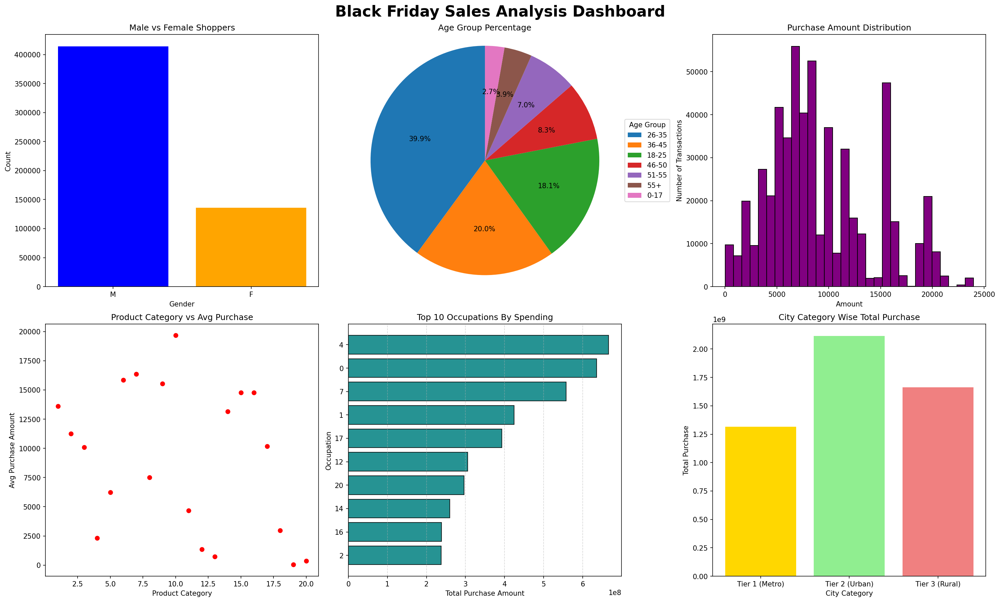
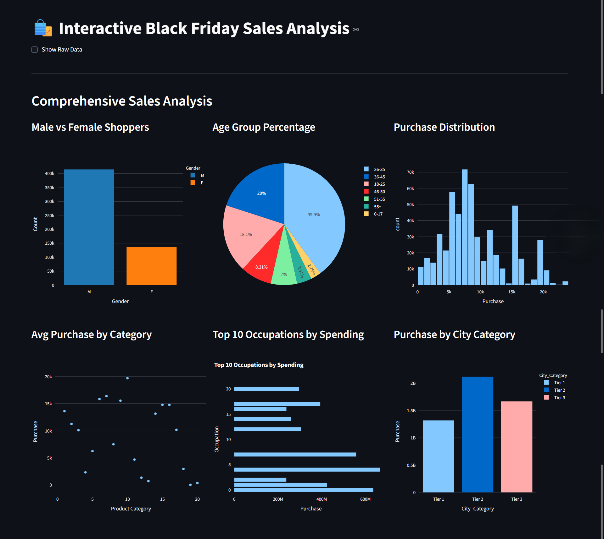

# Black Friday Sales Interactive Dashboard

[](https://blackfriday-sales-analysis-matplotlib-vbvwrzohxz8fmfyz3dt3d8.streamlit.app/)
[](https://python.org)
[](https://streamlit.io)
[](https://plotly.com)
[](https://pandas.pydata.org)
[](LICENSE)

An interactive web dashboard for analyzing Black Friday sales data, built with Streamlit and Plotly. This project transforms a static Matplotlib analysis into a dynamic, user-friendly application.

## 🚀 Live Demo

You can access the live, interactive dashboard here:
**[https://blackfriday-sales-analysis-matplotlib-vbvwrzohxz8fmfyz3dt3d8.streamlit.app/](https://blackfriday-sales-analysis-matplotlib-vbvwrzohxz8fmfyz3dt3d8.streamlit.app/)**

## 📋 Overview

This project analyzes a large Black Friday retail dataset and presents the findings in an interactive dashboard. Users can hover over charts to see detailed data points and gain business insights at a glance.

## ✨ Features

The interactive dashboard includes:

1.  **Gender Distribution**: Bar chart showing male vs female shoppers.
2.  **Age Group Analysis**: Interactive pie chart with age group percentages.
3.  **Purchase Amount Distribution**: Histogram with hover-able bins showing spending patterns.
4.  **Product Category Performance**: Scatter plot of average purchase by category.
5.  **Top Occupations by Spending**: Horizontal bar chart of the highest-spending occupations.
6.  **City Category Analysis**: Bar chart showing total purchases by city tier.

## 🛠️ Technology Stack

* **Python**: Core programming language.
* **Streamlit**: For creating and deploying the web application.
* **Plotly**: For generating interactive data visualizations.
* **Pandas**: For data manipulation and analysis.

## ⚡ Running the App Locally

To run this application on your own machine, follow these steps:

1.  **Clone the repository:**
    ```bash
    git clone [https://github.com/Kanaiya-rgb/blackfriday-sales-analysis-matplotlib.git](https://github.com/Kanaiya-rgb/blackfriday-sales-analysis-matplotlib.git)
    cd blackfriday-sales-analysis-matplotlib
    ```

2.  **Install dependencies from `requirements.txt`:**
    ```bash
    pip install -r requirements.txt
    ```

3.  **Run the Streamlit app:**
    ```bash
    streamlit run app.py
    ```
    The application will open in your web browser.

## 📂 Project Structure

```
blackfriday-sales-analysis-matplotlib/
├── .gitignore                 # Specifies files for Git to ignore
├── BlackFriday.csv            # 📊 The dataset used for the analysis
├── BlackFriday.ipynb          # 📓 The original Jupyter Notebook for Matplotlib analysis
├── LICENSE                    # Project's MIT License
├── README.md                  # 📄 Project documentation and information
├── app.py                     # 🚀 The main Streamlit application script
├── dashboard_blackfriday.png  # 🖼️ The static dashboard image generated by the original script
└── requirements.txt           # 📦 A list of all required Python libraries
```

## 🖼️ Dashboard Output

The script generates a high-resolution dashboard image (dashboard_blackfriday.png) with:
- **Size:** 20×12 inches at 150 DPI
- **Layout:** 2 rows × 3 columns grid
- **Format:** PNG with professional styling

## 🖼️ Previews

This project showcases the evolution from a static Matplotlib visualization to a dynamic Streamlit web application.

### Original Matplotlib Dashboard

This is the static dashboard generated by the `BlackFriday.ipynb` script using Matplotlib.



### Interactive Streamlit Dashboard

This is a preview of the live, interactive dashboard deployed on Streamlit Cloud, featuring Plotly charts.


## 💡 Key Insights

The dashboard reveals:
-   Key customer demographics (gender, age, occupation).
-   Interactive views of spending patterns and purchase behavior.
-   Product category performance and geographic distribution across city tiers.

## 👤 Author

This project was created and is maintained by **[Kanaiya-rgb](https://github.com/Kanaiya-rgb)**.

Feel free to connect or check out my other projects!

## 📄 License

This project is licensed under the MIT License. See the [LICENSE](LICENSE) file for more details.
